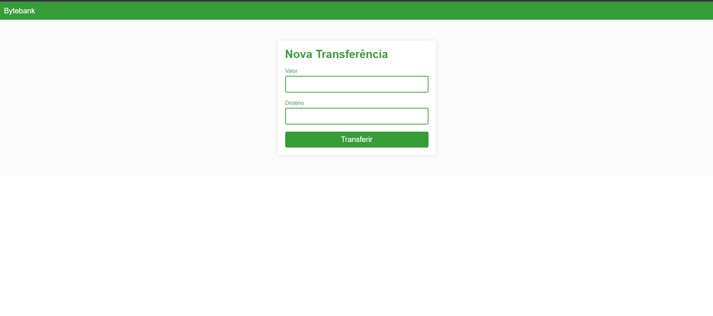
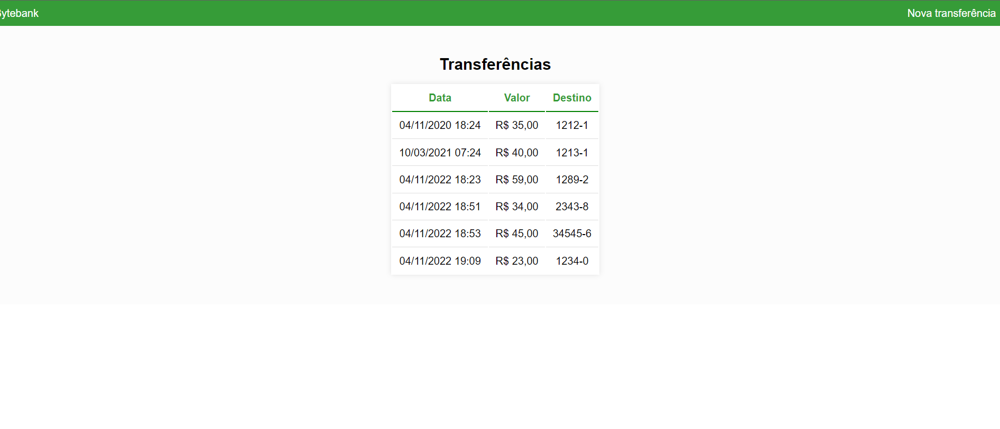

# App Byte Bank

## Telas
- Cadastro das transferências



- Tabelas com todas as transferências feitas



## Instalação
- npm install -g @angular/cli
- ng new bytebank
- cd bytebank
- ng serve --open
- [Acessar local](http://localhost:4200)

- *Desativando o Strict Mode*
    - Fazer algumas modificações no arquivo tsconfig.json
    - O arquivo ficará assim:
```
{
  "compileOnSave": false,
  "compilerOptions": {
    "baseUrl": "./",
    "outDir": "./dist/out-tsc",
    "sourceMap": true,
    "declaration": false,
    "downlevelIteration": true,
    "experimentalDecorators": true,
    "moduleResolution": "node",
    "importHelpers": true,
    "target": "es2017",
    "module": "es2020",
    "lib": [
      "es2020",
      "dom"
    ]
  }
}
```
- Estrutura de pastas
    - /.angular
    - /.vscode
    - /node_modules
    - /src
        - /app
        - /assets
        - /enviroments
        - favicon.ico
        - index.html
        - main.ts
        - polyfills.ts
        - styles.scss
        - test.ts
    - .browserslistrc
    - .editorconfig
    - angular.json
    - karma.config.js
    - package-lock.json
    - package.json
    - README.md
    - tsconfig.app.json
    - tsconfig.json
    - tsconfig.spec.json

##
- *Event Biding*
    - Passa um Binding do evento para uma propriedade do angular
```
// No arquivo HTML
(ngSubmit)="transferir()"

// No component TS
    transferir(){
        console.log("Transferir")
    }

```
- *property bind*
    - Passa um valor do template para minha classe
```
// No HTML
[(ngModel)]="valor"

// Component .TS
valor!: number;
```

## Exportando dados com output
- Enviando do componente filho para o pai


## Data no angular
- Adicionar  ao app.module
```
import localePt from '@angular/common/locales/pt';

registerLocaleData(localePt, 'pt');


providers: [
    {provide: LOCALE_ID, useValue: 'pt' },
    {
        provide: DEFAULT_CURRENCY_CODE,
        useValue: 'BRL',
    },
],
```
- https://angular.io/api/common/DatePipe
- https://angular.io/api/core/LOCALE_ID

## Mokando os dados
- https://www.npmjs.com/package/json-server
- npm install -g json-server
- Cria arquivo **db.json**
- Iniciar o json
```
json-server --watch db.json
```
- com base em um json ele monta a interface para o angular
- https://jsontots.pages.dev/

### Trabalhando com requisições 
- Adicionar ao construtor do service
```
private httpClient: HttpClient
```
- Adicionar ao app.module nos imports
```
import { HttpClientModule } from '@angular/common/http';

- imports
HttpClientModule
```
## Tranalhando com Rotas
- criar arquivo **app-routing.module.ts**
```
import { ExtratoComponent } from './extrato/extrato.component';
import { NgModule } from "@angular/core";
import { RouterModule } from "@angular/router";

import { Routes } from '@angular/router';
import { NovaTransferenciaComponent } from './nova-tranferencia/nova-transferencia.component';

export const routes: Routes = [
    {path: '', redirectTo: 'extrato', pathMatch: 'full' },
    {path: 'extrato', component: ExtratoComponent},
    {path: 'nova-transferencia', component: NovaTransferenciaComponent},
]

@NgModule({
    imports: [ RouterModule.forRoot(routes)],
    exports: [RouterModule]
})
export class appRoutingModule{

}
```
- importa em imports de app.module
- remove os componentes de app.componente.html e coloca isso
```
<router-outlet></router-outlet>
```